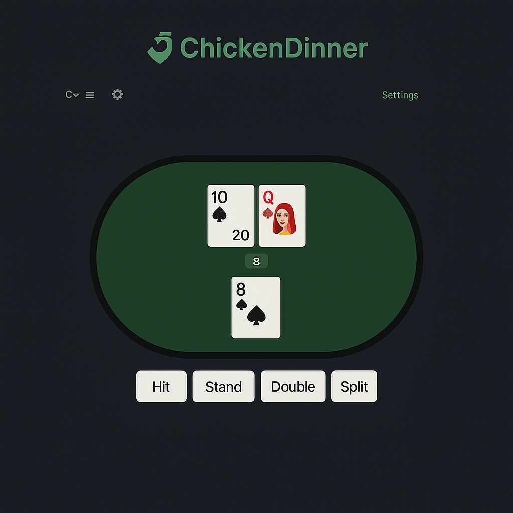

# 🂡 Chicken Dinner — Blackjack Strategy Trainer

## Overview

**Chicken Dinner** is a minimalist, MonkeyType‑inspired web app that teaches players to make perfect, "book‑correct" decisions at blackjack.  The site deals cards, asks the user to choose an action (Hit, Stand, Double, Split, or Surrender), and immediately shows whether that action matches optimal basic strategy.  Every hand, decision, and result is tracked in‑session to build live statistics and a post‑session review.

### Purpose & Goals

- **Skill‑building, not gambling.**  No real or simulated currency is exchanged; the focus is purely on learning.
- **Fast, distraction‑free UX.**  Loads instantly, runs offline as a PWA, and never requires sign‑in for core training.
- **Actionable feedback.**  Users see both *right/wrong* feedback **and** the correct move so they can learn per hand.
- **High accessibility standards.**  Keyboard shortcuts, color‑blind‑safe palette, and `aria‑live` announcements.


#### Gameplay Loop

- **Multi‑Hand Support**: Players can play up to **8 hands at once** by default, with the number of hands configurable in the Settings menu.
- **Splits**: Each individual hand may be **split up to 4 times**, subject to rule conditions. Split hands remain associated with their parent hand grouping.
- **Dealing Order**: Cards are dealt **right to left**, and played **right to left** as well—split hands follow the same directional rule.
- **Decision Evaluation**: Every action (Hit, Stand, Double, Split, Surrender) is validated against basic strategy. If a move is incorrect, the system records the correct one.
- **Dealer Behavior**: Dealer reveals the hidden card first, then plays out their hand according to current table rules (default: **hit on soft 17**).
- **Outcome Recording**: Win/loss for each hand vs. dealer is recorded for stats.


```mermaid
flowchart TD
  Start[Start of Round] --> Deal[Deal Cards to Player & Dealer (Right to Left)]
  Deal --> CheckBlackjack{Check for Blackjacks?}
  CheckBlackjack -->|Yes| EvaluateResults[Evaluate Outcomes & Show Feedback]
  CheckBlackjack -->|No| BeginPlay[Begin Player Turn Loop]

  subgraph PlayerTurn[Per-Hand Loop (Right to Left)]
    Action[Take Action: Hit / Stand / Double / Split / Surrender]
    Validate[Validate Action Against Strategy Chart]
    Feedback[Log Result: Correct or Incorrect, Save Correct Action]
    NextHand[Next Hand in Loop or to Dealer if Done]
    Action --> Validate --> Feedback --> NextHand
  end

  BeginPlay --> PlayerTurn --> DealerTurn[Reveal Dealer Hole Card → Play Dealer Hand]
  DealerTurn --> Compare[Compare All Hands to Dealer Final Hand]
  Compare --> Record[Record Outcomes: Win / Loss / Push per Hand]
  Record --> End[End of Round → Prompt Next Hand]
```

### Key Features

| Feature                        | Description                                                                                                                                                                                                                                           |
| ------------------------------ | ----------------------------------------------------------------------------------------------------------------------------------------------------------------------------------------------------------------------------------------------------- |
| **Zero‑Scroll Home**           | Single, viewport‑filling landing screen—no scrolling required.  The blackjack table is pre‑dealt and ready to play immediately, with a prominent hot‑keyable **Play** CTA.  Minimal text keeps the user focused on action.                            |
| **Live Game Engine**           | Defaults to a *6‑deck shoe* that shuffles only when the shoe is exhausted.  Dealer hits on soft 17.  All table rules—including deck count, hit/stand 17, surrender availability, and shuffle point—are configurable via an in‑app **Settings** modal. |
| **Strategy Checker**           | Every decision is compared against the basic‑strategy lookup; incorrect moves show the *exact* correct action.                                                                                                                                        |
| **Session & Extensible Stats** | Tracks accuracy %, win %, doubles won, splits won, streaks.  Free (non‑auth) tier stores data in `sessionStorage`; architecture exposes an event bus/API hooks so premium tiers can persist history to a backend.                                     |
| **Review Mode**                | Instant timeline of the current session’s hands with replay and filter pills (All / Incorrect / Doubles / Splits).                                                                                                                                    |
| **Responsive + PWA**           | Tailwind layout scales from mobile to 4K; Vite PWA plugin (future) enables offline training.                                                                                                                                                          |

### Design Inspiration

- **MonkeyType.com** — clean typography‑first layout and focus on a single action loop.

- **Blackjack table palette** — charcoal `#1e1e1e` background + felt green `#00aa66` accent.

- **JetBrains Mono** font for a coding‑esque, high‑legibility vibe.

- **Chicken Dinner layout** — minimalist UI on a light grey or dark background (user configurable). The central blackjack table is pill‑shaped and centered visually, matching the tabletop aesthetic. Core actions (Hit, Stand, Double, Split) are rendered as rounded buttons below. The logo and highlights use the same table green for consistency and visual reinforcement.




### Tech Stack

| Layer      | Choice                              | Rationale                                                |
| ---------- | ----------------------------------- | -------------------------------------------------------- |
| Build Tool | **Vite**                            | Ultra‑fast HMR and TypeScript template.                  |
| Framework  | **React 18 + TS**                   | Component model + type‑safety; easy state management.    |
| Styling    | **Tailwind CSS**                    | Utility classes for rapid, consistent dark‑mode theming. |
| State      | **React Context / Zustand**         | Lightweight global session state.                        |
| Testing    | **Vitest / RTL / Cypress**          | Unit → component → end‑to‑end pyramid.                   |
| CI & CD    | **GitHub Actions + Netlify/Vercel** | Automatic lint, test, and deploy on merge to `main`.     |

### Accessibility Highlights

- Full keyboard control (`1–5` hotkeys).
- Focus outlines and ARIA live regions for feedback messages.
- Colour palette passes WCAG AA contrast on dark background.

*Last updated: {{DATE}}*

